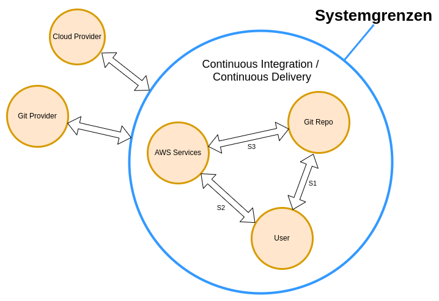
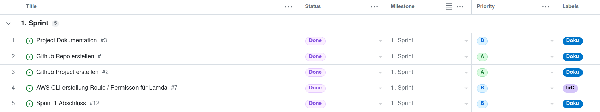

# ITCNE23-SEM-II

## Einleitung
Die zentrale Ausrichtung der Semesterarbeit konzentriert sich auf den Aufbau von Know-how im Bereich der Continuous Integration/Continuous Deployment (CI/CD) Pipeline unter Verwendung von AWS (Amazon Web Services). Das Ziel besteht darin, eine effiziente CI/CD-Pipeline zu erstellen, die in der Lage ist, eine Lambda-Funktion mithilfe von Git-Operationen zu aktualisieren. Der gesamte Prozess wird durch einen Git-PUSH ausgelöst, der wiederum AWS CodeBuild in Gang setzt. AWS CodeBuild übernimmt dabei das Deployment der aktualisierten Lambda-Funktion.

Die Lambda-Funktion, die Gegenstand dieser Pipeline ist, soll als REST API über das Web zugänglich sein. Dies bedeutet, dass die Funktionalität der Lambda-Funktion über HTTP-Anfragen erreichbar sein wird.

Der gesamte Ablauf beginnt mit Änderungen im Git-Repository, die durch einen Git-PUSH ausgelöst werden. Dieses Ereignis dient als Auslöser für AWS CodeBuild, das den Build-Prozess initiiert und sicherstellt, dass alle erforderlichen Abhängigkeiten und Ressourcen korrekt verarbeitet werden. Nach einem erfolgreichen Build übernimmt AWS CodeBuild das Deployment der Lambda-Funktion in der AWS-Infrastruktur.

Um sicherzustellen, dass die Lambda-Funktion als REST API über das Web zugänglich ist, wird das AWS API Gateway eingesetzt. Dies umfasst die Konfiguration von Endpunkten sowie die Implementierung von Sicherheitsmassnahmen, um eine nahtlose und sichere Kommunikation mit der Lambda-Funktion zu gewährleisten. Das AWS API Gateway spielt dabei eine zentrale Rolle, indem es als Schnittstelle zwischen externen Anfragen und der Lambda-Funktion fungiert.

### Übersicht

## Projektmanagement
Die gewählte Projektmanagementmethode für diese Semesterarbeit ist Kanban, eine agile Arbeitsmethode, die darauf abzielt, Arbeitsprozesse zu visualisieren und den Arbeitsfluss effektiv zu steuern. Die Entscheidung für Kanban basiert auf der Flexibilität und Anpassungsfähigkeit, die diese Methode bietet, insbesondere im Hinblick auf die Dynamik von Forschungsprojekten und Semesterarbeiten.

Um die Semesterarbeit effektiv zu verwalten, wird sie in mehrere Iterationen, auch als Sprints bekannt, unterteilt. Diese Sprints dienen dazu, den Fortschritt der Arbeit zu verfolgen, klare Ziele für bestimmte Zeiträume zu setzen und regelmässige Überprüfungen durchzuführen. Die Aufgaben werden entsprechend priorisiert und in die Kanban-Board-Phasen wie "To-Do", "In Progress" und "Done" einsortiert, um einen klaren Überblick über den Projektstatus zu gewährleisten.

Für das Gesamtprojektmanagement wird ein Github Project verwendet ([ITCNE23-SEM-II](https://github.com/users/blro-ep/projects/6)). Github Project ermöglicht eine integrierte und kollaborative Verwaltung von Aufgaben, Issues und Milestones. Hier können nicht nur die Kanban-Boards erstellt werden, sondern auch die Fortschritte dokumentiert, Diskussionen geführt und notwendige Ressourcen bereitgestellt werden. Diese zentrale Plattform fördert die Zusammenarbeit und erleichtert die Nachverfolgung von Änderungen.

### Kanbanboard
Die Visualisierung der Arbeitsprozesse erfolgt auf einem Kanban-Board, das als zentrales Instrument für das Projektmanagement dient. Durch die Nutzung dieses Kanban-Boards wird nicht nur eine übersichtliche Darstellung sämtlicher Aufgaben ermöglicht, sondern auch das Ziel verfolgt, den Arbeitsfluss zu optimieren und die Gesamteffizienz des Projekts zu steigern.
Dies fördert nicht nur eine konsequente Arbeitsweise, sondern erleichtert auch die schnelle Identifikation von Engpässen und Bottlenecks im Arbeitsfluss.
Die effektive Nutzung dieses visuellen Instruments bildet somit einen wesentlichen Beitrag zur erfolgreichen Umsetzung der Semesterarbeit und ermöglicht eine flexible Anpassung an sich verändernde Anforderungen während des gesamten Projektablaufs.

### Roadmap
Die strategische Planung und Steuerung der Semesterarbeit erfolgt durch eine ausgearbeitete Roadmap, die wichtige Meilensteine enthält. Diese Meilensteine sind auf die einzelnen Sprints abgestimmt und dienen als Orientierungspunkte für die Fortschrittsverfolgung und den erfolgreichen Abschluss der einzelnen Etappen des Projekts.

| Datum | Sprint |
| --- | --- |
| 27.11.23 | Ergebnis 1. Sprint |
| 18.12.23 | Ergebnis 2. Sprint |
| 31.01.24 | Ergebnis 3. Sprint / Abgabe / Abnahem |

### Tasklist
Um die Verwaltung und Organisation der Aufgaben weiter zu optimieren, wird eine Taskliste erstellt. Die Taskliste dient dazu, die Aufgaben zu erfassen, Aufgaben nach verschiedenen Kategorien zu filtern und zu gruppieren. Ziel ist, eine höhere Übersichtlichkeit und Strukturierung innerhalb des Projektmanagements zu gewährleisten.

Die Taskliste wird so gestaltet, dass jeder Task mit spezifischen Metadaten versehen werden kann, die eine einfache Zuordnung zu bestimmten Kategorien ermöglichen. 

#### Task Kategorien
- Status
- Priority
- Milestones

#### Task Status
Das Kanbanboard wir in 4 Spalten aufgeteilt.
- Todo
- In Progress
- Done
- Backlog

#### Task Labels
Es werden folgende Labels verwendet um die Tasks nach Themen zu gruppieren
- Doku  --> Task für die Dokumentation
- IaC   --> Task für Infrastructure as Code
- FaaS  --> Task für Function as a Serivce
- Zert  --> Zertifizierung

### SEUSAG
#### Systemgrenze

#### Einflussgrössen

#### Unter- bzw. Teilsysteme 

#### Schnittstellen
| Schnittstelle | 
Element
 | Beschreibung |
|---------------|---------|-------------|
| S1 | User / Git Repo | Der Code für die AWS Lambda Function wird in einem Git Repo verwaltet. |
| S2 | User / AWS Services | Das Deployment der AWS Ressourcen erfolgt via AWS CLI / AWS SDK. |
| S3 | Git / AWS | Das Deployment der Lambda Function erfolgt auf dem Git Repo. |

#### Analyse der Unter- bzw. Teilsysteme

##### AWS Provider
AWS wird verwendet, um eine FaaS zur Verfügung zu stellen, welche auf dem Service AWS Lambda aufgebaut wird.
Das Deploment soll von Github angestossen werden und mitteld CodeBuild automatisch erfolgen. 
Es ist zu prüfen, welche AWS Services für die Vorgehen zusätlich benötigt werden.

##### Github
Das GitHub Repository fungiert als zentraler Speicherort für den gesamten Code der Semesterarbeit. Hier werden sämtliche Ressourcen, Skripte und Konfigurationen verwaltet. 
Zusätzlich dient das Repository als Schnittstelle für das Aktualisieren der Lambda-Funktion. Durch das Auslösen eines Git-Push-Vorgangs werden die Änderungen an der Lambda-Funktion automatisch übernommen.

##### Entwicklungsumgebung
Distributor ID: Ubuntu
Description:    Ubuntu 22.04.3 LTS
Release:	    22.04
Codename:	    jammy

#### Gemeinsamkeiten
- Git
- Python
- AWS-Schnittstellen

### Ziele SMART
- Die nötigen AWS-Ressourcen für die Lambda Function sollen automatisiert erstellt werden können (z.B. AWS-CLI / AWS-SDK).
- Die Lambda Function soll mit einem Git PUSH Befehl aktualisiert werden können. Dies bedeutet, dass die Code Änderungen aus dem GitRepo auto. in die Lambda Function übernommen wird.
- Die Lambda Function soll mit der Programmiersprache Python umgesetzt werden.
- Mittels GET API Request soll die Function mindestens den Status Code 200 zurück geben.

### Sprints
Nach Abschluss eines Sprints wird eine Reflektion durchgeführt, die einen entscheidenden Bestandteil des agilen Projektmanagements darstellt. In diesem Prozess werden nicht nur die erreichten Fortschritte betrachtet, sondern auch Herausforderungen, Erfahrungen und mögliche Verbesserungspotenziale identifiziert. Ein zentrales Element dieser Reflexion ist die grafische Festhaltung des Status der Taskliste, was dazu dient, einen klaren Überblick über den Sprint-Verlauf zu erhalten.

#### Sprint 1 - 27.11.23

##### Reflektion
Die von GitHub bereitgestellten Projektmanagement-Tools erweisen sich als äusserst wirkungsvoll. Die unkomplizierte Erstellung von Kanban-Boards, Roadmaps und Aufgabenlisten ermöglicht einen klaren und schnellen Überblick über den aktuellen Projektstatus.

Die Projektdokumentation wurde übersichtlich im Readme-Dateiformat festgehalten. Die bewusste Entscheidung, auf die manuelle Erstellung eines Inhaltsverzeichnisses zu verzichten, hat sich als effektiv erwiesen. Dies liegt daran, dass GitHub standardmässig über diese Funktion verfügt und somit eine klare und strukturierte Navigation innerhalb der Dokumentation ermöglicht.

Die Erstellung von Rollen mithilfe der AWS CLI verläuft reibungslos und bildet die Grundlage für die automatisierte Erstellung der Lambda-Funktion. Die Unterscheidung, ob eine Rolle nicht existiert oder die Abfrage ein Problem aufweist, gestaltete sich aufwändiger als ursprünglich angenommen.

Die Automatisierung mittels AWS CLI wird weiterhin beibehalten.

#### Sprint 2 - 18.12.23

**AWS Certified Cloud Practitioner**
Die Zertifizierung zum AWS Certified Cloud Practitioner hat mehr Zeit in Anspruch genommen als geplant.
Nachdem der erste Zertifizerungsversuche gescheiter war, habe ich mich mit folgenden Udemy Kursen auf die Prüfung vorbereitet [Ultimate AWS Certified Cloud Practitioner CLF-C02](https://www.udemy.com/share/103aFP3@TVzIE-KAghw3WT8BwYR3Eeg8C2WlORvf5_H3--T_a0D-fd6zdpe-7h2Lqm8TlU_vlw==/) / [6 Practice Exams | AWS Certified Cloud Practitioner CLF-C02](https://www.udemy.com/share/103e7s3@dO3_bmtPGRwYUTRlrmP7w7rLxmDDnp7NST5OVyaZiPfK12O_qLlovBH81VjxB8tEdQ==/).
Bei den Übungen hatte ich dann bemerkt, dass ich vielfach bei den selben Themen immer wieder Probleme hatte. Somit habe mir mittels [Anki](https://apps.ankiweb.net/) eine quelloffene Lernkartei-Software installerit und diese Punkte so zusätliche gelernt. 
Am 05.12.2023 konnte ich dann die Zertifizierung erfolgreich abschliessen.
[AWS Certified Cloud Practitioner certificate](./picture/AWS%20Certified%20Cloud%20Practitioner%20certificate.png)

**IaC**
Nachdem ich mich in das AWS SDK eingearbeitet hatte, entschied ich mich dazu, sämtliche Automatisierungen mit Hilfe von boto3 (Python) durchzuführen. Daher habe ich die bestehenden AWS CLI Bash-Scripts aus dem Sprint 1 direkt umgeschrieben.

Die Automatisierung mittels Boto3 gestaltete sich jedoch aufwändiger als erwartet, insbesondere aufgrund der komplexen Abhängigkeiten zwischen Lambda-Funktionen, Rollen, Richtlinien und CodeBuild. Besonders herausfordernd war die Implementierung der CodeBuild-Automatisierung. Die Dokumentation allein lieferte nicht ausreichend Klarheit darüber, welche Werte zwingend erforderlich sind und wie sie korrekt eingefügt werden müssen. In diesem Zusammenhang war es hilfreich, die Erstellung über die grafische Benutzeroberfläche durchzuführen und die Konfiguration anschliessend in eine JSON-Datei zu exportieren.

Dieser Sprint war äusserst lehrreich im Kontext des Deployments mithilfe von CodeBuild und GitHub. In CodeBuild wird die Source (GitHub), das Container-Image für die Verarbeitung sowie die zu berücksichtigenden Ereignisse (Webhook) festgelegt. Eine interessante Option besteht darin, dass neben dem Ereignis (Push) auch Abhängigkeiten zur Commit-Nachricht definiert werden können. Auf diese Weise können für das Deployment spezifische Abhängigkeiten zwischen dem Ereignis und der Nachricht festgelegt werden.
Zusätzlich müssen die entsprechenden Berechtigungen (Policy/Role) vorhanden sein.

Aus den Erkenntnissen aus diesem Sprint, würde ich heute den IaC Teil direkt mit boto3 umsetzten.
Des Weiteren war die Zwei-Faktor-Authentifizierung über Microsoft Authenticator für AWS und GitHub eher lästig. Daher habe ich mich entschieden, zwei YubiKeys ([yubikey-5c-nano](https://www.yubico.com/ch/product/yubikey-5c-nano/) / [yubikey-5c-nfc](https://www.yubico.com/ch/product/yubikey-5c-nfc/)) anzuschaffen. Nach der Registrierung gestaltet sich die Anmeldung äusserst entspannt. Diese Schlüssel können zudem für verschiedene Online-Anwendungen genutzt werden.

**FaaC**
In diesem Sprint wurde mir klar, dass ich zusätzliche AWS-Komponenten benötige (API Gateway), damit die Function via Web erreichbar ist. Dies bedeutet, dass im Sprint 3 weiterhin Zeit für die Infrastruktur als Code (IaC)-Umsetzung investiert werden muss, und mir daher die Zeit für die Entwicklung von Functions as a Service (FaaS) fehlt. Es würde ein zusätlichner Issue für den Sprint 3 erfasst [AWS API Gateway](https://github.com/blro-ep/ITCNE23-SEM-II/issues/16).

Trotz dieser Herausforderung habe ich mich dazu entschieden, den Fokus auf die IaC zu legen und den FaaS-Teil so einfach wie möglich zu halten.

#### Sprint 3 - 31.01.24

**Zertifizierung AZ-900: Microsoft Azure Fundamentals**
Für die Prüfungsvorbereitung bin ich vor allem dem [Microsoft training course](https://learn.microsoft.com/en-us/training/courses/az-900t00) gefolgt und habe die offiziellen Probleprüfungen mehrmals durchgespielt [Exams AZ-900](https://learn.microsoft.com/en-us/credentials/certifications/exams/az-900/).

Als züstzliche Unterstützung habe ich das Udemy Learining [az900-azure](https://www.udemy.com/course/az900-azure/) gekauft.
Die Prüfung wurde am 29.12.2023 erfolgreich absolviert [Microsoft Certified: Azure Fundamentals](https://learn.microsoft.com/api/credentials/share/en-us/RogerBlum-7482/25F3FCE9EAE61434?sharingId=965F21179058A5EF).

**API Gateway**
Die Automatisierung des API Gateways muss in einzelne Schritte unterteilt werden. Zunächst sollte die Ressource erstellt werden, unter der die GET-Methode für die Lambda-Funktion platziert wird. Anschliessend sollten Request- und Response-Einstellungen hinzugefügt werden. Nachdem dies abgeschlossen ist, muss die API für die Lambda-Funktion autorisiert werden. Dieser Schritt hat viel Zeit in Anspruch genommen, bis ich die Lösung gefunden habe.

Allerdings war die Lambda-Funktion zu diesem Zeitpunkt noch nicht über das Internet (Postman) erreichbar. Dafür musste auf dem API Gateway eine Stage eingerichtet werden. Diese erhält dann eine Aufruf-URL, die für externe Anfragen genutzt werden kann.

**Optimierungen der boto3 automatisierungen**
Den IaC-Teil habe ich in mehrere Python-Skripte aufgeteilt. Um das Deployment mit einem einzelnen Skript durchzuführen, rufe ich diese über ein zentrales Skript auf. Das Problem war, dass die einzelnen Skripte einzeln funktionierten, aber das zentrale Skript nicht. Nachdem ich eine Verzögerung zwischen den Aufrufen der einzelnen Skripte eingefügt habe, hat es funktioniert.

Für das Testen des gesamten Deployments habe ich ein Löschskript erstellt, das analog zum Deployment funktioniert. In Zukunft würde ich dieses bereits früher erstellen, da es eine grosse Erleichterung beim Testen darstellt, anstatt den Setup manuell zu löschen.

Der Python-Code hat sicherlich noch Optimierungspotenzial. Zum Beispiel könnte man die Variablen global setzen und zusätzliche Überprüfungen einbauen.

**Beschreibung Deployment**
Um das Deployment während der Präsentation besser zu erläutern, habe ich mich für ein BPMN Digramm entschieden. BPMN ermöglicht eine rasche und leicht verständliche Darstellung der wichtigsten Schritte.
Gleichzeitig war es für mich hilfreich, die Abfolge der Prozesse erneut zu überdenken und zu optimieren.

**Zentrale Configuration für Variablen**
Auf Grundlage des Inputs von Dozent Armin Dörzbach habe ich die zentralen Konfigurationsvariablen ausgelagert. Zur Umsetzung wählte ich die Python configparser Library und speicherte die Konfiguration in einer ini-Datei. Jedes Skript, das die ConfigParser-Klasse nutzt, überprüft zunächst, ob die Konfiguration geladen werden kann. Andernfalls wird das Skript abgebrochen. Die Aufteilung im ini-File nach Sektionen macht es besonders angenehm und übersichtlich zu lesen. Die Einbindung in die Skripte gestaltet sich ebenso einfach und gut verständlich.

Ein etwas aufwendigerer Schritt war die Aktualisierung der Variablen in den yml/json-Dateien. Hierbei entschied ich mich dafür, die buildspec.yml während des Deployments anhand eines Templates neu zu erstellen. Gleichzeitig aktualisierte ich das CodeBuildTrustPolicy.json zur Laufzeit mit den korrekten Werten. Aus Gründen der Nachvollziehbarkeit bevorzuge ich die erste Variante. Soweit ist die integration gut gelungen, sodass die Namen der Objekte über die Zentrale Konfiguration angeapsst werden können.

**Präsentation Semesterarbeit**
Für meine Semesterarbeitspräsentation habe ich mich für Google Docs entschieden. Um die zeitliche Begrenzung von ca. 10 Minuten und die Herausforderung von insgesamt 16 Präsentationen an einem Nachmittag zu berücksichtigen, habe ich mich darauf fokussiert, die wichtigsten Informationen auf 5 Folien zu komprimieren. Ziel ist es, dass die Zuhörer den Inhalt meiner Semesterarbeit verstehen und durch die Live-Demo einen fundierten Einblick erhalten können.
[TBZ Cloud-native Engineer ITCNE23, 2. Semester](https://docs.google.com/presentation/d/1XO7bUU0lEar4-m5H9oxfbq7Zo9dFgMaFuzZ-DY0fSpo/edit?usp=sharing)

**Fazit der Semesterarbeit**
Das Fazit der Semesterabeit soll ein Zusammenzug der drei Spints sein und wir in einem seperaten Punkt beschrieben ([Fazit](#fazit)). 

## Installation

### AWS CLI
Für das automatisierte Deployment wurde die AWS CLI gemäss folgender Anleitung installiert [Install or update the latest version of the AWS CLI](https://docs.aws.amazon.com/cli/latest/userguide/getting-started-install.html#cliv2-linux-install).

### Phyton (Boto3)
Um das Deployment mittels Python zu automatisieren, habe ich Boto3 anhand von foldender AWS Dokumentation installiert [boto3.amazonaws.com - quickstart](https://boto3.amazonaws.com/v1/documentation/api/latest/guide/quickstart.html).

#### Configparser
Die Globalen Variabelen werden in ein Config.ini File ausgelagert. 
Für das Handling wird die Python Library [configparser](https://docs.python.org/3/library/configparser.html) verwendet.

## AWS Komponenten

### IAM
- [iam](https://boto3.amazonaws.com/v1/documentation/api/latest/reference/services/iam.html)

### Lambda
- [lambda](https://boto3.amazonaws.com/v1/documentation/api/latest/reference/services/lambda.html)

### CodeBuild
- [codebuild](https://boto3.amazonaws.com/v1/documentation/api/latest/reference/services/codebuild.html)

### API Gateway
- [apigateway](https://boto3.amazonaws.com/v1/documentation/api/latest/reference/services/apigateway.html)

## Build Details
Für das Deployment der CI/CD-Pipeline wurden mehrere Python-Skripte erstellt, die über ein zentrales Skript ausgeführt werden. 

### Execute Deployment
Folgendes Skript ist verantwortlich für die Erstellung sämtlicher erforderlicher AWS-Komponenten.
- [Deployment.py](Deployment.py)

Dieses ruft folgende SubScripts auf:
- [CreateLambdaRole.py](CreateLambdaRole.py)
- [CreateLambdaFuction.py](CreateLambdaFuction.py)
- [CreateCodeBuildBuildspec.py](./CreateCodeBuildBuildspec.py)
- [CreateCodeBuildPolicy.py](CreateCodeBuildPolicy.py)
- [CreateCodeBuildRole.py](CreateCodeBuildRole.py)
- [CreateCodeBuildProject.py](CreateCodeBuildProject.py)
- [CreateCodeBuildWebhook.py](CreateCodeBuildWebhook.py)
- [CreateAPIGateway.py](CreateAPIGateway.py)
- [PutAPIGatewayMethod.py](PutAPIGatewayMethod.py)
- [AddLambdaPermission.py](AddLambdaPermission.py)

#### Übersicht Execute Deployment

### Undo Deployment
Folgendes Skript ist verantwortlich für die Löschung der verwendeten AWS-Komponenten.
- [Deployment_undo.py](Deployment_undo.py)

- [DeleteAPIGateway.py](DeleteAPIGateway.py)
- [DeleteCodeBuild.py](DeleteCodeBuild.py)
- [DeleteLambdaFunction.py](DeleteLambdaFunction.py)
- [DetachIAMPolicyFromRole.py](DetachIAMPolicyFromRole.py)
- [DeleteIAMPolicy.py](DeleteIAMPolicy.py)
- [DeleteIAMRole.py](DeleteIAMRole.py)

#### Übersicht Undo Depoyment

## Testing

### Testprotokoll Deployment
Die Testaktivitäten umfassen die Verwendung der von lokalen Python-Scripts, AWS-Konsole sowie das Testing über das Internet mithilfe von Postman.

| Fall | Beschreibung | Test Step | Erwartetes Resultat | Status | Screen |
| ---     | ---     | ---   | ---     | ---   |  ---   |
| TC-01 | IaC | Start Deployment Script | Sämtliche Scripts werden ohne Error ausgeführt | AWS Infrastructure erstellt | [TC-01](./picture/TestCases/TC-01.png) |
| TC-02 | AWS IAM | Prüfen IAM Policy | IAM Policy vorhanden | Infrastructure erstellt | [TC-02](./picture/TestCases/TC-02.png) |
| TC-03 | AWS IAM | Prüfen IAM Roles | IAM Roles vorhanden | Infrastructure erstellt | [TC-03](./picture/TestCases/TC-03.png) |
| TC-04 | AWS Lambda | Prüfen Lambda Function | Lambda Function vorhanden | Infrastructure erstellt | [TC-04](./picture/TestCases/TC-04.png) |
| TC-05 | AWS ColdeBuild | Prüfen CodeBuild Project | Codebuild Project vorhanden | Infrastructure erstellt | [TC-05](./picture/TestCases/TC-05.png) |
| TC-06 | AWS API Gateway | Prüfen API Gateway | API Gateway vorhanden | Infrastructure erstellt | [TC-06](./picture/TestCases/TC-06.png) |
| TC-07 | Github | Github Commit mit Anpassung an Lambda Python Script | Änderung auf Github erfolgreich eingecheckt |  Commit "verified signature" | [TC-07](./picture/TestCases/TC-07.png) |
| TC-08 | AWS CodeBuild | Prüfen Codebiild | Aufgrund des Commit wurde CodeBuild gestartet | Build Status "Succeeded" | [TC-08](./picture/TestCases/TC-08.png) |
| TC-09 | Postman | Prüfen Lambdas Function | Lambda Fuction aufruf via Postmann möglich | Status Code 200 | [TC-09](./picture/TestCases/TC-09.png) |
| TC-10 | IaC | Start Deployment undo | Sämtliche Scripts werden ohne Error ausgeführt | AWS Infrastructure gelsöcht (Prüfe TC-02 bis TC-06) | [TC-10](./picture/TestCases/TC-10.png) |

### Testing AWS Infrastructure

#### Lambda
Nach dem Deployment kann die Funktionalität der Lambda-Funktion mithilfe der Standard-Testfunktion überprüft werden. Diese ist wie folgt zu finden.

#### CodeBuild
Nach dem Deployment kann CodeBuild durch einen GitHub-Commit getestet werden. Nach dem Commit wird der Build Run gestartet, und die einzelnen Schritte sind in den Phase Details ersichtlich.

#### API Gateway
Nach dem Deployment kann  API Gateway mithilfe der Standardfunktion überprüft werden.

### Postman
Die Lambda-Funktion kann extern über Postman getestet werden, wofür die Invoke-URL der AWS API Gateway Stages erforderlich ist.

## Fazit
Semesterarbeit TBZ Cloud-native Engineer, Klasse ITCNE23, 2. Semester.

Ziel der Semesterarbeit war, eine CI/CD Pipeline in der AWS mittels IaC automatisiert aufzubauen, um damit eine Lambda Function zu aktualliesieren.
Die Umsetzung des IaC Teil erfolgte mittels Python (Boto3), welches mehrere Sripts beinhaltet, die beim Deployment seriel abgearbeitet werden. Auf Input des Donzenten Armin Dörzbach wurden wiederkehrende Variablen in eine zentrale Koniguration ausgelager, damit diese an einer Stelle geändert werden können (z.B.: AWS Region, AWS ID, LambdaFunction Name, CodeBuildProjectName, API-GatewayName usw.).
Die ersten Gehversuche für den IaC Teil hatte ich mit Bash-Scripts gemacht, da ich dies bereits kannte. Der Switch auf Pyhton (Boto3) war am Anfang etwas harzig, bis ich das Prinzip mit den Klassen begriffen hatte. Die Boto3 AWS Dokumentation ist sehr umfangreich und enthält sehr gute Beschreibungen und Beispiele. Am meisten Aufwand hat mir die CodeBuild Implementierung gemacht, dies aufgrund des grossen Umfang sowie die verschieden Implementierungsmöglichkeiten. Anhand der Dokumentation war für mich oft nicht klar, welche Werte übergeben werden müssen. So konnte ich teilweise nur eine Lösung finden, indem ich den Setup über die AWS Console gemacht habe, und anschliessend mittels Boto3 ausgelesen habe. So konnte ich die Infos in die Python Scripts überführen. Das API Gateway gehörte ebenfalls zu den grösseren Herausforderungen, da dieses in viele unterschiedlich Teile aufgesplittet ist und noch explizit auf der Lambda Function berechtig werden muss. 
Der Code hat sicherlich noch viel optimierungs Potential, ebenfalls müsste die Security durchleutet werden. Heute würde ich den Code in kleinere Scripts aufteilen und für das Testing gleich ein Script erstellen, welches das Deployment Rückgängig macht. Zudem würde ich globale Variablen gleich zu Beginn in ein Konfigrationsfile auslagern.

Die Semseterabeit hat sehr viel Spass gemacht, in welcher ein grosser Teil des gelernten aus dem Lerngang ITCNE23 umgesetzt werden konnte. 
Das autoamtisierte Deployment hat mir die Vorteile von IaC verinnerlicht. Das Deployment ist immer identsch, sowie benötig es nur einen Bruchteil des manuellen Setup.
Die Umsetzung des Deployment mittels Boto3 hat meine Python Kenntnisse gefestigt, sowie den Umgang mit Klassen aufgezeigt.
Ebenfalls durfte ich viel über die AWS Services IAM, Lambda, CodeBuild, API-Gateway lernen. Es ist erstaunlich, was mit meinem heutigen Wissenstand bereits möglich ist, das Potential ist jedoch noch riesig.

Wieso habe ich die AWS / Azure Zertifizierung in dieses Semester integriert.
Im Q4/23 wurde unsere Abteilung bei der Swisscom informiert, dass im 2024 allenfalls neues Business für AWS / Azure bei uns in die Abteilung kommt. Für die Mitarbeit ist die Zertifizierung zum *AWS Certified Cloud Practitioner / AZ-900 Microsoft Azure Fundamentals* von Vorteil. Aus diesem Grund habe ich mich entschieden, diese beiden Zertifierungen ebenfalls in diese Semesterarbeit zu integrieren.
Die AWS Zertifizierung hat sich als Aufwändiger als gedacht herausgestellt. Eine grosse Hilfe waren hier die Udemy Kurse, welche ich durchgearbeitet habe.
Anschliessend habe ich den AZ-900 gemacht, wobei ich stark von der AWS Zertifizierung profitieren konnte. Das Prinzip ist indentisch, einfach andere Namen. Für die AZ-900 Zertifizerung habe ich mich vorallem an den LernPath von Microsoft gehalten. 
Aufgrund der Zertifizierungen war der Monat Dezember eine grosse Herausforderung mit dem Terminmanagement, damit der praktische Teil der Semesterarbeit nicht zu kurz kam.
Schlussendlich hat sich jedoch der Aufwand gelohnt. Für mich gehören diese beiden Zertifizierungen zu diesem Lerngang.

Der Yubikey war nicht teil der Semesterarbeit, hat sich jedoch bewährt bei den Arbeiten mit AWS / Github.
Eine wirkliche Erleichterung für die 2-Faktor authenfizierung, welche nicht mehr missen möchte. Ich verwende diesen heute auf verschieden Plattformen und finde dies eine konfortable Lösung.